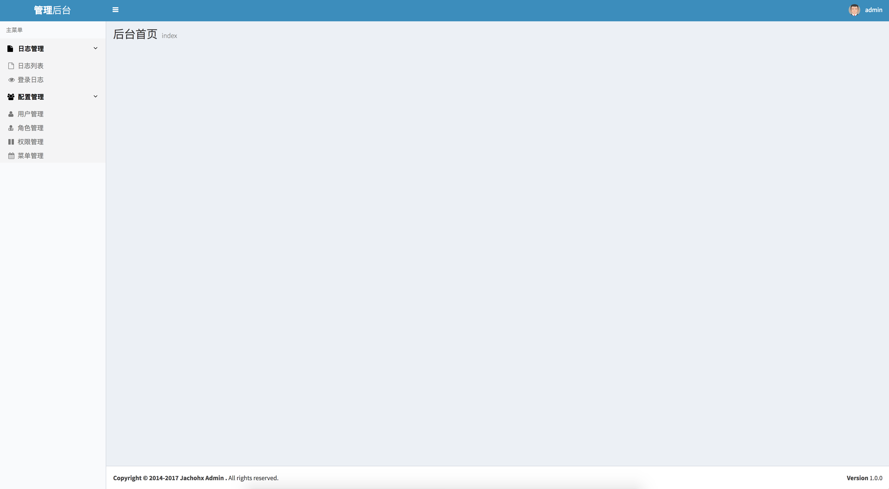
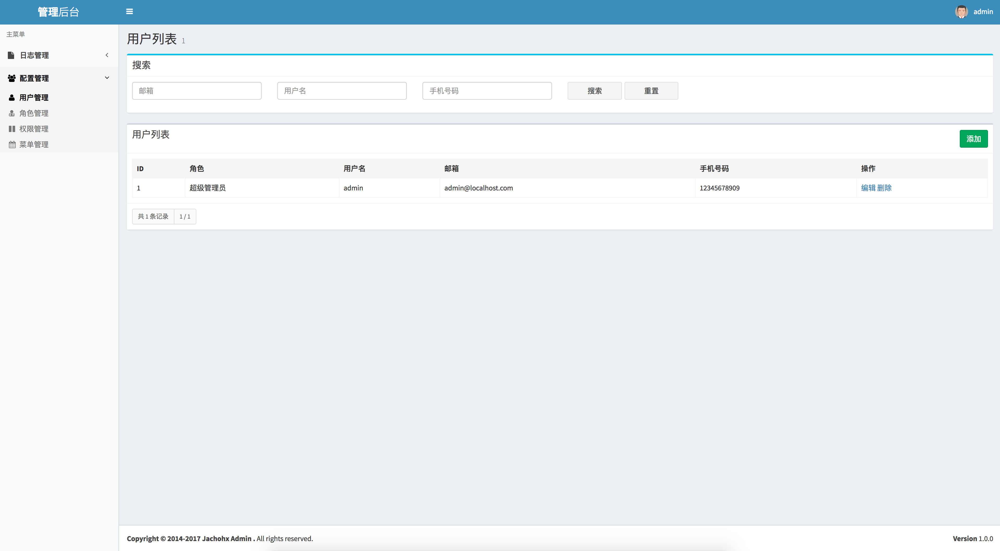
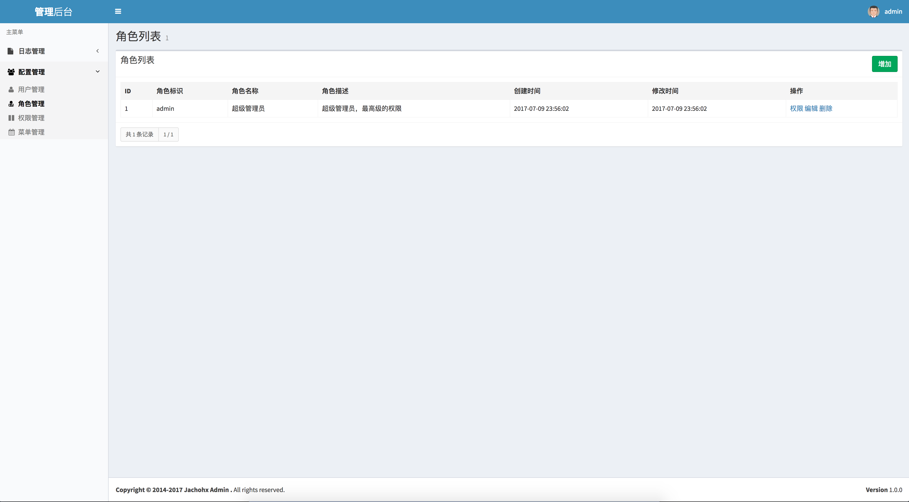
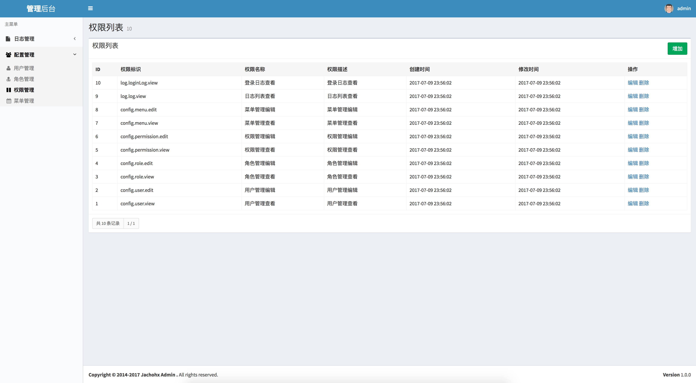
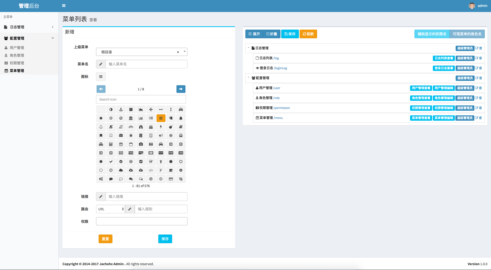

## 说明
urpm 是一套基于Laravel封装的后台用户管理权限系统，能够让开发者不用再关心权限问题，实现后台功能的快速开发。

U（User）用户管理；

R（Role）角色管理；

P（Permission）权限管理；

M（Menu）菜单管理。

框架`Demo`地址:[Demo](http://108.61.186.199:8088/)

`Demo`账号:`admin` 密码:`123456`

如果你喜欢这个开源项目，记得在右上角点个 star 哦，谢谢：）

## **特点**：

- 用户管理：
	- 用户可以配置权限
- 角色管理
	- 角色可以配置用户
	- 角色可以配置权限 
- 权限管理：
	- 不需要在代码上进行权限控制；
	- 在权限管理里可以控制controller类的访问；
	- 权限控制可以控制get/post请求，也可以控制某个方法请求；
	- 权限控制的控制也可以上边两种请求的多种结合，可精确某个一请求的控制。
- 菜单管理：
	- 菜单可以对应url前缀、controller类；
	- 可以控制哪些角色可以看到；
	- 菜单的位置可以直接通过拖拽排序。

## 导航
- [说明](#说明)
- [特点](#特点)
- [效果图](#效果图)
	- [首页](#首页)
	- [用户管理](#用户管理)
	- [角色管理](#角色管理)
	- [权限管理](#权限管理)
	- [菜单管理](#菜单管理)
- [安装要求](#安装要求)
- [获取代码](#获取代码)
- [安装依赖](#安装依赖)
- [生成APP_KEY](#生成APP_KEY)
- [修改`env`配置](#修改-env-配置)
- [数据库迁移](#数据库迁移)
- [访问首页](#访问首页)
- [插件](#插件)
	- [表单提交](#表单提交)
	- [列表删除](#列表删除)
- [代码修改](#代码修改)
	- [修改`env`配置](#修改-env-配置-1)
	- [修改`app/Http/Kernel.php`注册`middleware`](#修改-apphttpkernelphp-注册-middleware)
	- [修改`config/app.php`注册`aliases`](#修改-configappphp-注册-aliases)
	- [修改`routes/web.php`注册`route`](#修改-routeswebphp-注册-route)
	- [修改`app/Providers/EventServiceProvider.php`注册`listen`](#修改-appproviderseventserviceproviderphp-注册-listen)
- [感谢](#感谢)
- [更新日志](#更新日志)

## 效果图

### 首页



### 用户管理



### 角色管理



### 权限管理



### 菜单管理



## 安装要求

- Laravel 5.3+
- php 5.6.4
- composer


## 获取代码

```
git clone https://github.com/jachohx/urpm.git
或
git clone https://git.oschina.net/jacho/urpm.git
```

## 安装依赖

```
//在项目代码根目录执行
composer install
```

## 生成APP_KEY

```
//在项目代码根目录执行，如果已经有的就不需要生成了
php artisan key:generate
php artisan config:clear
```

## 修改 `.env` 配置

```
//修改数据库配置，以DB_开头的配置
//修改APP_URL
```

## 数据库迁移

```
//在项目代码根目录执行
//增加表
php artisan migrate
//增加默认数据
composer dump-autoload
php artisan db:seed
```

## 访问首页

```
访问APP_URL
比如我的首页：http://108.61.186.199:8088/
登录用户：admin
登录密码：123456
```

## 插件

### 表单提交

- 说明：

> 根据laravel路由restful规则，数据更新Cotroller有两个方法，分别是store，update；store是新数据存储，update是数据修改；在请求参数里的_method=POST对应Controller的store方法，PUT对应Controller的update方法。

- 提交方式：

> 表单以.post方式提交，默认增加参数_method=POST，如果提交的表单有id参数，且id值>0，_method=PUT。

- 参数说明：

```
class ： _submit_，有此class，则使用表单提交插件
data-form-id ：必填，指定要提交的form ID
data-url：选填，以post提交form的URL，如果不填，使用form的action，url遵循store方法的restful规则，如果是数据修改，自动会在url上加上id参数，不需要自己增加；
data-refresh-url：选填，提交成功后跳转的url，如果不填，则当前页面刷新
```
- 插件使用：

```
//提交#form /menu/1的请求，且_method=PUT，提交成功后跳转到/
<form id="form" action='/menu'>
<input type="hidden" name="id" value="1" />
<button type="submit" class="_submit_" data-form-id="form" data-refresh-url="/">提交</button>
```

### 列表删除

- 说明：

> 根据laravel路由restful规则，数据删除使用的是Controller里的destroy方法，请求参数里有_method=DELETE则会使用到Controller的destroy方法。

- 参数说明：

```
class ： _delete_，有此class，则使用列表数据删除插件
data-url：必填，以post提交此URL，url规则遵循restful
```
- 插件使用：

```
//提交/menu/1请求，且_method=DELETE，提交成功后刷新当前页
<a href="#" class="_delete_" data-url="/menu/1">删除</a>
```

## 代码修改

> 以下是项目对配置文件做的修改，不用在代码修改，仅供大家参考

### 修改 `.env` 配置

```
//修改数据库配置，以DB_开头的配置
//修改APP_URL

//增加以下配置
//SQL语句是否打印，不需要的话，可以改成false
DB_LOG=true
//权限配置不能编辑的ID
//用户不能删除的ID
DB_USER_CANNOT_MANAGE_IDS=1
//角色不能删除的ID
DB_ROLE_CANNOT_MANAGE_IDS=1
//权限不能删除的ID
DB_PERMISSION_CANNOT_MANAGE_IDS=1,2,3,4,5,6,7,8,9,10
//菜单不能删除的ID
DB_MENU_CANNOT_MANAGE_IDS=1,2,3,4,5,6,7,8
```

### 修改 `app/Http/Kernel.php` 注册 `middleware` 

```php
$routeMiddleware => [
    'permission'            => \App\Http\Middleware\AdminPermission::class,
]
```

### 修改 `config/app.php` 注册 `aliases`
```php
'aliases' => [
    'Admin' => App\Facedes\AdminFacedes::class,
]
```
### 修改 `routes/web.php` 注册 `route`

```php
//auth
Route::group(['prefix' => '/auth', 'namespace' => "Auth", 'middleware' => ['csrf']], function () {
    Route::get('login',                     'LoginController@showLoginForm')->name('login');
    Route::post('login',                    'LoginController@login');
    Route::get('logout',                    'LoginController@logout')->name('logout');
    Route::post('logout',                   'LoginController@logout')->name('logout');
});

//
Route::group(['prefix' => '/', 'middleware' => ['auth', 'permission']], function () {
    Route::resource('/menu/tree',           'MenuController@tree');
    Route::resource('/menu',                'MenuController');
    Route::get('/role/{id}/permission',     'RoleController@permissionEdit');
    Route::post('/role/{id}/permission',    'RoleController@permissionStore');
    Route::resource('/role',                'RoleController');
    Route::resource('/user',                'UserController');
    Route::resource('/permission',          'PermissionController');
    Route::resource('/info',                'InfoController');
    Route::resource('/log',                 'LogController');
    Route::resource('/loginLog',            'LoginLogController');

    Route::resource('/',                    'HomeController');
});
```

### 修改 `app/Providers/EventServiceProvider.php` 注册 `listen`

```php
//如果DB_LOG=true，要把这个listen加上，当然，如果不需要打印SQL日志，不需要加上这个配置
protected $listen = [
    'Illuminate\Database\Events\QueryExecuted' => [
    	'App\Listeners\DatabaseEventListener'
    ]
];
```

## 感谢

- [AdminLTE](https://adminlte.io/)
- [bootstap-iconpicker](https://github.com/victor-valencia/bootstrap-iconpicker)

## 更新日志

- [](https://github.com/jachohx/urpm/archive/1.0.0.zip)
  - 初始化版本

如果你喜欢这个开源项目，记得在右上角点个 star 哦，谢谢：）

